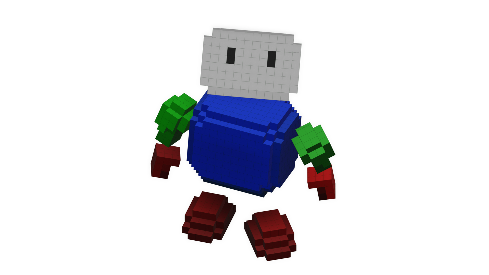

# Game Development Training Repository

Welcome to the Game Development Training Repository, part of the ["Recreating Old Games in Godot" series by Acanixz](https://www.youtube.com/@Acanixz).

This repository contains various projects created to enhance my game development skills as I pursue a career in this field.

*Currently, there isn't much content, but every journey starts with a first step.* ¯\\_(ツ)_/¯

## Contributing

Contributions are welcome! Please see the [CONTRIBUTING.md](CONTRIBUTING.md) file for guidelines on how to get started.

## License
This project is licensed under the MIT License. See the [LICENSE](LICENSE) file for details.