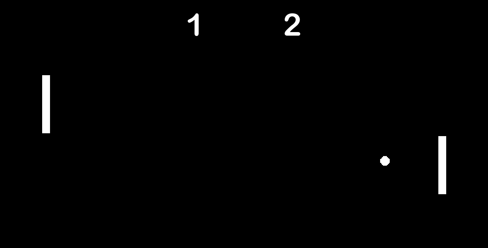

# Pong

This is a recreation of Pong made in Godot Engine in about 3 days, the physics are unpredictable, but it works well enough for a release version.

The player who scores 3 points first wins.

## Controls

### Player 1

- W = Left paddle up
- S = Left paddle down

### Player 2
- Up Arrow = Right paddle up
- Down Arrow = Right paddle down