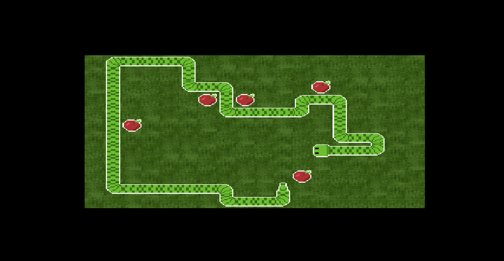

# Snake

This is a recreation of Snake made in Godot, the game improves on grid-based movement and UI styling when compared to previous games.

## Table of Contents
- [Controls](#controls)
- [Installation](#installation)
- [How to Play](#how-to-play)
- [Contributing](#contributing)
- [License](#license)

## Controls
- W = Move up
- S = Move down
- A = Move left
- D = Move right

## How to Play
- Use the controls listed above to navigate the snake.
- Eat the apples to grow.
- Avoid running into the walls or the snake's own body.

We welcome contributions! Please see the [CONTRIBUTING.md](../CONTRIBUTING.md) file for guidelines on how to contribute.